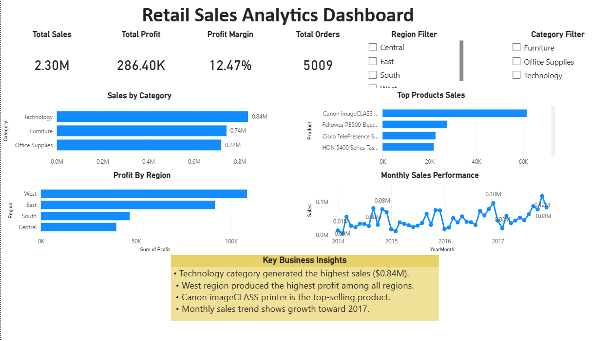

# Retail Sales Analytics Dashboard

This project analyzes retail sales performance using Power BI.

The dashboard provides insights into revenue trends, product performance, regional profitability, and monthly sales growth.

## Dashboard Preview

## Tools Used
- Power BI
- DAX
- Data Modeling

## Key Insights

- Technology category generated the highest sales ($0.84M).
- West region produced the highest profit among all regions.
- Canon imageCLASS printer is the top-selling product.
- Monthly sales show steady growth toward 2017.
